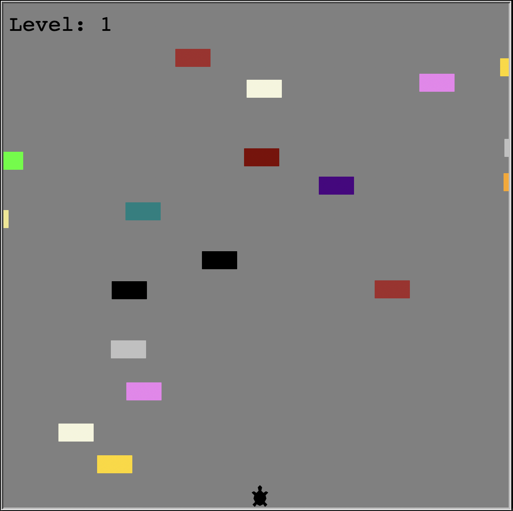

# Turtle Crossing Game

Bu, Python ile yazılmış basit bir Turtle Crossing oyunudur. Oyuncu, ekrandaki kaplumbağayı ileri ve geri hareket ettirerek yolda geçen engellerden kaçmaya çalışır.

## 🛠️ Gereksinimler

- Python 3.x
- `turtle` ve `random` kütüphaneleri

## ⚙️ Kurulum ve Çalıştırma

1. Python yüklü olduğundan emin olun.
2. Proje dosyasını bilgisayarınıza indirin.
3. Terminal veya komut istemcisinde proje klasörüne gidin.
4. `python main.py` komutunu kullanarak oyunu başlatın.

## 📸 Ekran Görüntüsü

## 📩 Mesaj

Bu, ilk oyun projelerimden biri. Her türlü geri bildirime açığım ve gelecekte projeyi geliştirmeyi planlıyorum!

İyi eğlenceler! 🎮🐢
