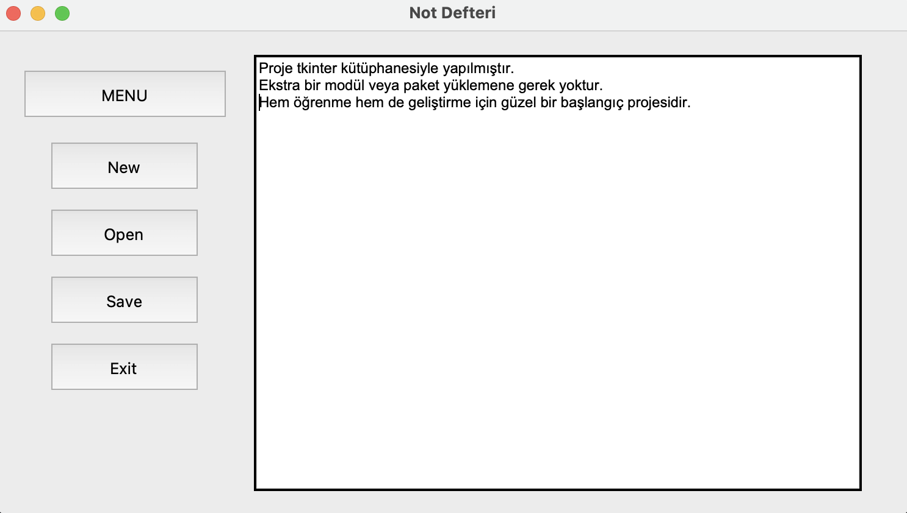

# 📝 Simple Notepad App (Tkinter)

Bu proje, Python'un `tkinter` kütüphanesi kullanılarak geliştirilmiş basit bir **Not Defteri Uygulamasıdır**.  
Kullanıcılar yazı yazabilir, yeni dosya oluşturabilir, dosya açabilir, yazdıklarını kaydedebilir ve çıkmadan önce kayıt uyarıları alabilir.

---

## 📸 Uygulama Görseli

---

## ✨ Uygulama Özellikleri

- **Yeni Dosya (`New`)**:  
  Yazma alanındaki mevcut yazıları temizler. Yeni bir çalışma başlatmanı sağlar.

- **Dosya Aç (`Open`)**:  
  Bilgisayardan bir `.txt` dosyası seçip içeriğini uygulamaya yükler.  
  Var olan dosya içeriğini düzenlemeye devam edebilirsin.

- **Dosya Kaydet (`Save`)**:  
  Mevcut yazılanları `.txt` formatında kaydeder.  
  Eğer dosya henüz bir adla kaydedilmemişse, kaydederken isim seçmeni ister.

- **Çıkış (`Exit`)**:  
  Uygulamayı kapatır. Eğer kaydedilmemiş yazı varsa, çıkmadan önce uyarır ve onay ister.

- **Kısayol Tuşları (Mac)**:
  - ⌘ + N → Yeni dosya
  - ⌘ + O → Dosya aç
  - ⌘ + S → Kaydet

- **Dinamik Menü Sistemi**:
  - Sol üst köşedeki **MENU** butonuna basıldığında, "New", "Open", "Save" ve "Exit" seçenekleri açılır/kapanır.  
  - Böylece ekran sade tutulur, sadece gerektiğinde butonlar görünür.

- **Boş Kaydetme Engeli**:
  - Eğer yazı alanı boşsa, kullanıcıya "Text is empty" uyarısı verilir ve boş kaydetmeye izin verilmez.

- **Görsel İyileştirmeler**:
  - Yazı yazma alanı (`Text` widgetı) daha geniş tutuldu.
  - Butonlar hizalı ve estetik görünecek şekilde ayarlandı.

---

## 🛠️ Projeyi Çalıştırmak

1. Dosyayı bilgisayarına indir veya GitHub üzerinden klonla.
2. Terminal veya kod editöründen dosyanın bulunduğu klasöre git.
3. Aşağıdaki komutu çalıştırarak uygulamayı başlat:
4.	Uygulama açıldığında:
   
  •	Hemen yazı yazmaya başlayabilir.

  •	Menü butonuna tıklayarak seçenekleri açabilir.

  •	Kısayol tuşlarını kullanarak hızlı işlem yapabilirsin.

⸻

## 💬 Notlar
	•	Proje tkinter kütüphanesiyle yapılmıştır.
	•	Ekstra bir modül veya paket yüklemene gerek yoktur.
	•	Hem öğrenme hem de geliştirme için güzel bir başlangıç projesidir.

⸻

## 📜 Lisans

Bu proje tamamen açık kaynaklıdır.
Dilersen geliştirebilir, değiştirebilir veya kendi projelerinde kullanabilirsin!

