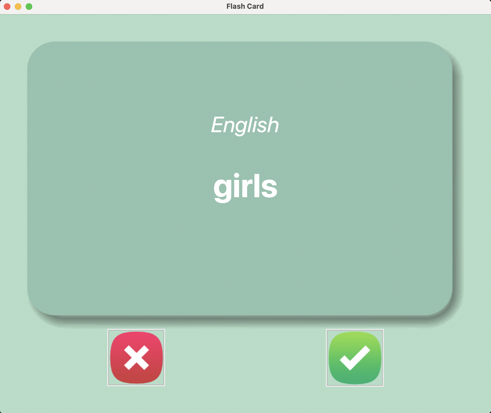
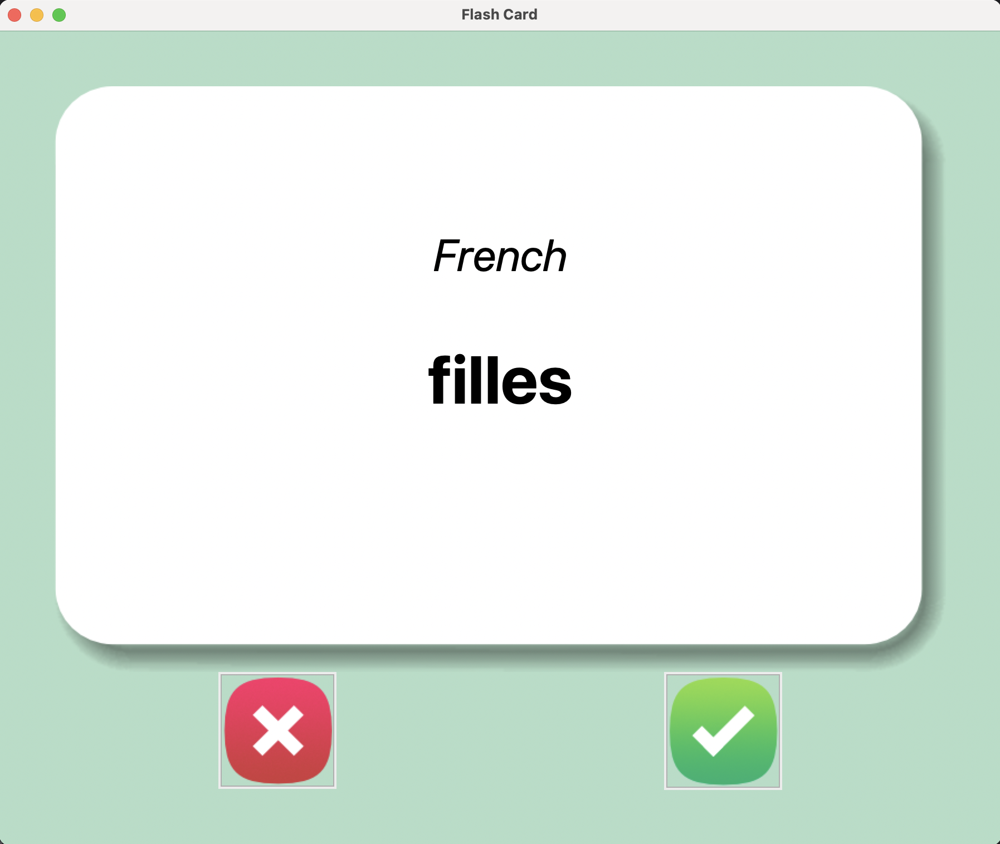

# 📚 French-English Flashcard App

Bu proje, **Fransızca–İngilizce kelime ezberlemeyi kolaylaştıran** bir flashcard uygulamasıdır.  
Tkinter arayüzüyle görsel olarak öğrenmeyi destekler ve kullanıcının öğrendiği kelimeleri otomatik olarak kaydeder.

## 🎯 Özellikler

- 🧠 Her 3 saniyede kart otomatik çevrilir
- ✅ Öğrenilen kelimeler bir daha gösterilmez
- ❌ Bilinmeyen kelimeler tekrar gelir
- 📁 Veriler otomatik olarak kaydedilir (CSV dosyası)
- 🎨 Görsel destekli kullanıcı arayüzü (card_front / card_back)

---
## 📸 Ekran Görüntüsü




## 📦 Proje Dosya Yapısı

```
.
├── images/
│   ├── card_back.png       # Kartın arka yüzü (İngilizce)
│   ├── card_front.png      # Kartın ön yüzü (Fransızca)
│   ├── right.png           # Doğru cevabı temsil eden buton görseli
│   └── wrong.png           # Yanlış cevabı temsil eden buton görseli
├── data/
│   ├── french_words.csv    # Tüm Fransızca–İngilizce kelimeler
│   └── words_to_learn.csv  # Öğrenilmeyen kelimelerin tutulduğu dosya
├── main.py                 # Ana Python uygulaması
```

> Not: `words_to_learn.csv` dosyası program ilk çalıştırıldığında otomatik oluşur.

---

## 🔁 Uygulama Akışı

1. Uygulama rastgele bir Fransızca kelime gösterir.
2. 3 saniye sonra kart otomatik olarak İngilizce anlamını gösterir.
3. Kullanıcı:
   - ✅ biliyorsa: sağ butona tıklayıp, kelimeyi kalıcı olarak listeden çıkarabilir.
   - ❌ bilmiyorsa: sol butona tıklayıp, tekrar çalışması için bırakabilir.
4. `data/words_to_learn.csv` dosyası sürekli güncellenerek ilerleme kaydedilir.

---

## ⚙️ Kullanılan Kütüphaneler

- `tkinter` — Kullanıcı arayüzü
- `pandas` — CSV dosya işlemleri
- `random` — Rastgele kart seçimi

---

## ▶️ Uygulamayı Başlat

1. Gerekli modülleri yükle (pandas yoksa):
```bash
pip install pandas
```

2. Uygulamayı çalıştır:
```bash
python main.py
```

---

## 🧠 Öğrenme Kaydı

- Kullanıcı her doğru bildiği kelimede sağ butona tıklarsa, bu kelime `words_to_learn.csv` içinden **kaldırılır**.
- Uygulama bu dosyayı güncelleyerek sonraki çalışmalarda **öğrenilenleri atlar**.
- Dosya yoksa, otomatik olarak `french_words.csv` üzerinden yeni liste oluşturulur.

---

## 📩 Geliştirici

**İsmail Orhan**  
📧 ismailorhan831@gmail.com

---

## ⭐ Katkıda Bulun

Görsel tasarım, daha fazla dil desteği ya da özellik önerilerin varsa katkı sağlayabilirsin.  
Star ⭐ vererek projeyi desteklemeyi unutma!
