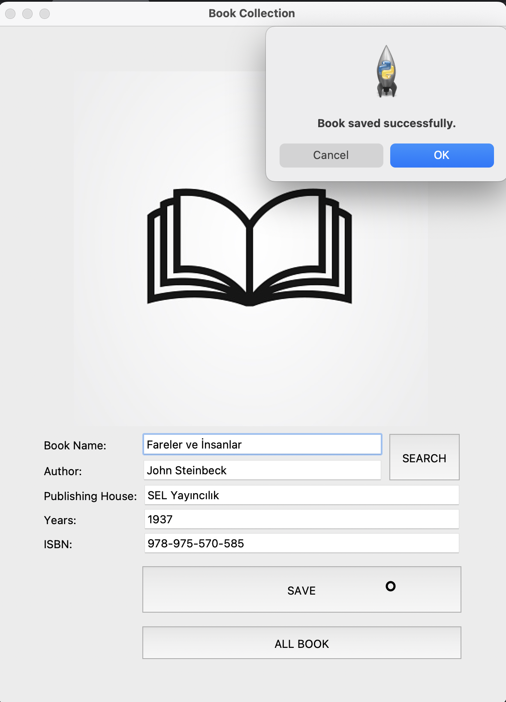
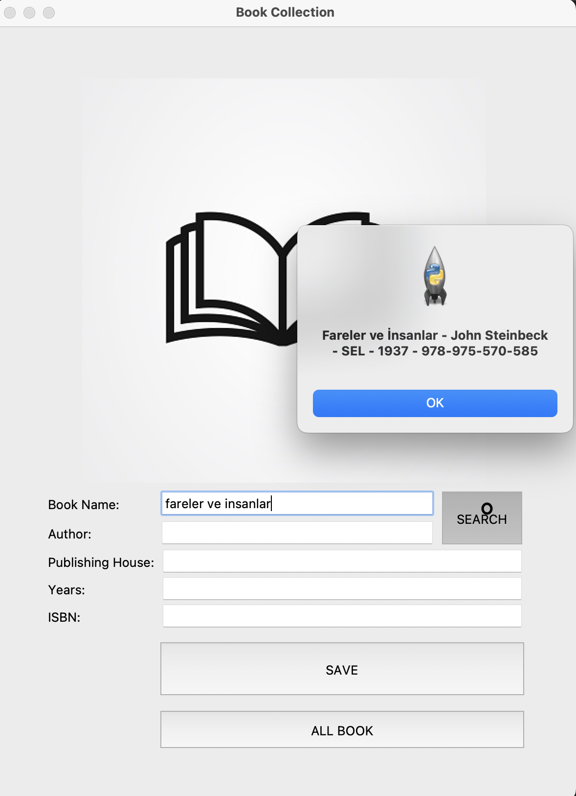

# 📚 Book Collection App

Bu proje, kişisel kitap koleksiyonunu kolayca yönetebilmen için geliştirilmiş bir masaüstü uygulamasıdır. Python’da tkinter, turtle, pandas ve messagebox kütüphaneleri kullanılarak oluşturulmuştur.

---

## 📸 Uygulama Görseli




---

## 🚀 Özellikler
### 	•	Açılış Ekranı (Opening Screen)
Uygulama çalıştığında, 3 saniyelik hoş geldiniz mesajı gösteren bir turtle ekranı açılır. Bu ekran sadece uygulama başında bir kez görünür.
### 	•	Kitap Ekleme (Save Functionality)
Kullanıcıdan kitap bilgileri (Book Name, Author, Publishing House, Years, ISBN) alınır.
Tüm alanlar doluysa kullanıcıdan onay alınır ve kitap bilgisi .csv dosyasına kaydedilir.
Kaydın ardından alanlar temizlenir ve başarı mesajı gösterilir.
### 	•	Kitap Arama (Search Functionality)
Kitap ismi veya yazar ismine göre arama yapılabilir.
Eşleşen kitap(lar) varsa ayrı ayrı bilgi kutusunda gösterilir.
Hiçbir eşleşme yoksa kullanıcı bilgilendirilir.
### 	•	Tüm Kitapları Görüntüleme (See All Books)
Kaydedilen tüm kitaplar bir mesaj kutusunda listelenir.
Hiçbir kitap kaydı yoksa kullanıcı uyarılır.
### 	•	Dosya İşlemleri (File Operation)
Kitap bilgileri Book_Collection.csv adlı dosyada tutulur.
Eğer bu dosya yoksa uygulama çalıştırıldığında otomatik olarak boş bir dosya mantığında başlatılır.
### 	•	Görsel Kullanımı (book_image.png)
Ana arayüzde bir kitap resmi (book_image.png) gösterilir. Uygulamanın daha kullanıcı dostu olmasını sağlar.

---

## 🖼️ Arayüz Hakkında
	•	tkinter ile oluşturulmuş basit bir form yapısı vardır.
	•	Giriş alanları (Entry) üzerinden kullanıcı bilgileri girer.
	•	Button ile kullanıcı işlemleri tetiklenir (SAVE, ALL BOOK, SEARCH).
	•	Resim ve etiketler arayüzü zenginleştirir.
---

## 🧾 Gerekli Dosyalar
	•	Book_Collection.csv: Kitap verilerinin saklandığı dosya. Otomatik oluşturulur.
	•	book_image.png: Uygulamada gösterilen kitap görseli. Aynı klasörde bulunmalıdır.
---

## ⚠️ Dikkat Edilmesi Gerekenler
	•	Arama yaparken kitap adı ya da yazar adı yazmak zorunludur. Her ikisini birden yazmak da mümkündür.
	•	SAVE işlemi öncesi tüm alanların doldurulmuş olması gerekir.
	•	book_image.png adlı resim dosyası bulunmazsa uygulama hata verir.
	•	Uygulama çalıştığında açılış ekranı 3 saniye sonra otomatik kapanır ve tkinter arayüzü başlar.
---

## 📌 Genel Yapı

```plaintext
📁 Proje Klasörü
├── 📄 Book_Collection.py       # Ana uygulama dosyası
├── 📄 Book_Collection.csv      # Kitap bilgilerini tutan CSV dosyası (ilk çalıştırmada otomatik oluşur)
├── 🖼️  book_image.png           # Uygulama arayüzünde kullanılan kitap görseli
└── 📄 README.md                # Proje açıklamalarını içeren bu dosya

