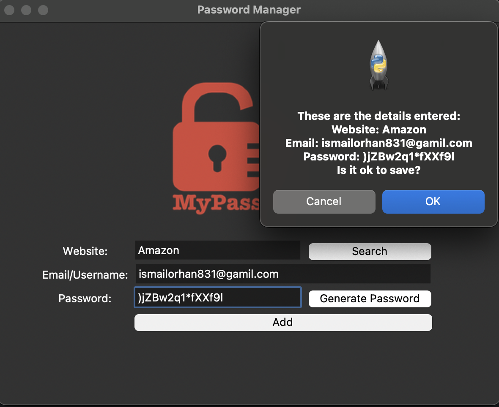
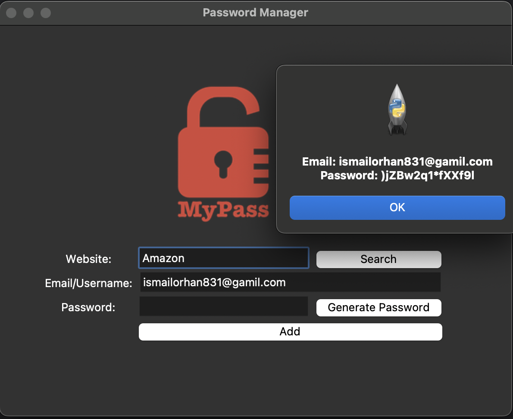

# 🔐 Password Manager

Python ile yazılmış basit ve işlevsel bir Şifre Yöneticisi uygulaması.
Bu program, kullanıcıların rastgele şifre oluşturmasına, şifreleri yerel olarak saklamasına ve daha sonra aramasına olanak tanır.

## 📸 Görsel

## 🚀 Özellikler
	•	✅ Rastgele şifre üretimi
	•	✅ Üretilen şifreyi otomatik panoya kopyalama
	•	✅ Kullanıcı bilgilerini JSON dosyasına kaydetme
	•	✅ Belirli bir web sitesi için kayıtlı şifreyi arama ve gösterme
	•	✅ Kullanıcı dostu, basit grafiksel arayüz (Tkinter ile)

⸻

### 📂 Proje Yapısı

.
├── logo.png          # Uygulama logosu (200x200 piksel önerilir)

├── main.py           # Tüm uygulama kodlarının yer aldığı Python dosyası

└── data.json         # Şifre ve email bilgilerinin saklandığı dosya (otomatik oluşturulur)

⸻

### ⚙️ Kullanılan Teknolojiler
	•	tkinter – Grafiksel arayüz için
	•	random – Rastgele şifre üretimi
	•	pyperclip – Şifreyi panoya kopyalamak için
	•	json – Verileri dosyada saklamak için

⸻

### 📌 İnce Detaylar
	•	Alan Kontrolü: Website, Email ve Password alanlarının boş bırakılması engellendi.
	•	Otomatik Kopyalama: Üretilen şifre otomatik olarak panoya kopyalanır.
	•	Veri Güncelleme: Aynı website tekrar eklenirse eski kayıt üzerine yazılır.
	•	Hata Yönetimi: data.json dosyası eksikse veya website bulunamazsa kullanıcı bilgilendirilir.
	•	Kullanıcı Onayı: Şifre kaydedilmeden önce kullanıcıdan onay istenir.

⸻

### ▶️ Başlatmak İçin
	1.	Projeyi klonla:

git clone https://github.com/kullanici_adi/password-manager.git
cd password-manager

	2.	Gerekli modülü yükle:

pip install pyperclip

	3.	Uygulamayı çalıştır:

python main.py

⸻

### 🛡️ Uyarılar
	•	Uygulama verileri yalnızca data.json dosyasına kaydeder.
	•	Önemli/gizli şifreleri saklamadan önce güvenlik açısından dikkatli olun.
	•	İnternete veri gönderilmez, tüm işlem yerel olarak çalışır.

⸻

### 📧 Geliştirici

İsmail Orhan
📩 ismailorhan831@gmail.com

⸻

⭐ Katkı Sağla

Projeyi geliştirerek katkıda bulunabilir veya hata bildirebilirsin.
Star ⭐ verirsen çok sevinirim!

