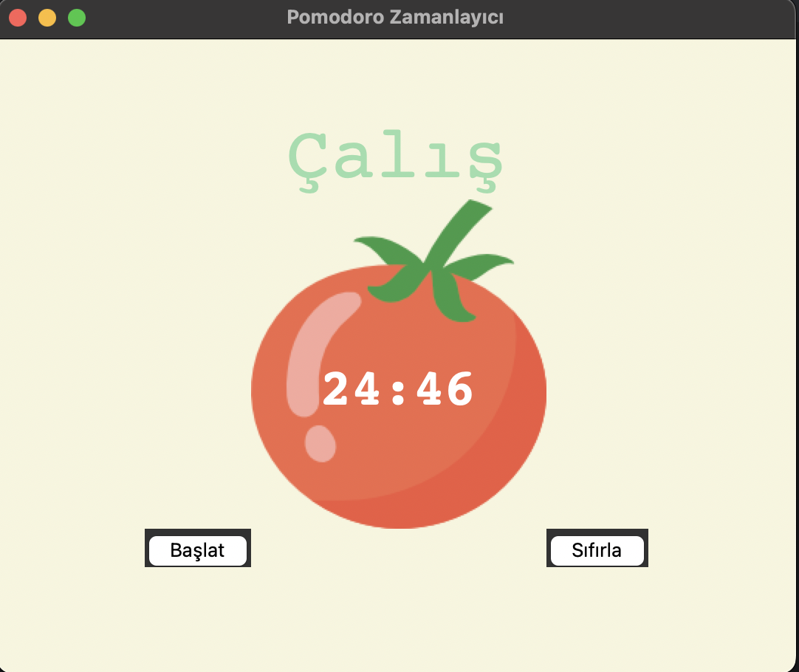

# Pomodoro Zamanlayıcı ⏱️🍅

Bu, basit ama şık bir **Pomodoro zamanlayıcı uygulamasıdır**. Python'un `tkinter` kütüphanesiyle geliştirildi. Odaklanma süreni artırmak ve düzenli molalar vermek için kullanabileceğin verimli bir araçtır.

---

## 🎯 Özellikler

- 25 dakika çalışma süresi
- 5 dakikalık kısa mola
- 20 dakikalık uzun mola
- Otomatik olarak döngüleri takip eder
- Her tamamlanan çalışma için bir ✔️ işareti gösterir
- Sade, renkli ve kullanıcı dostu arayüz

---

## 🖼️ Ekran Görüntüsü

Aşağıda uygulamanın nasıl göründüğünü görebilirsin:




---

## ▶️ Başlatmak için

1. Python 3 yüklü olduğundan emin ol.
2. Aşağıdaki komutlarla projeyi başlatabilirsin:

```bash
git clone https://github.com/kullaniciadi/pomodoro-zamanlayici.git
cd pomodoro-zamanlayici
python main.py
