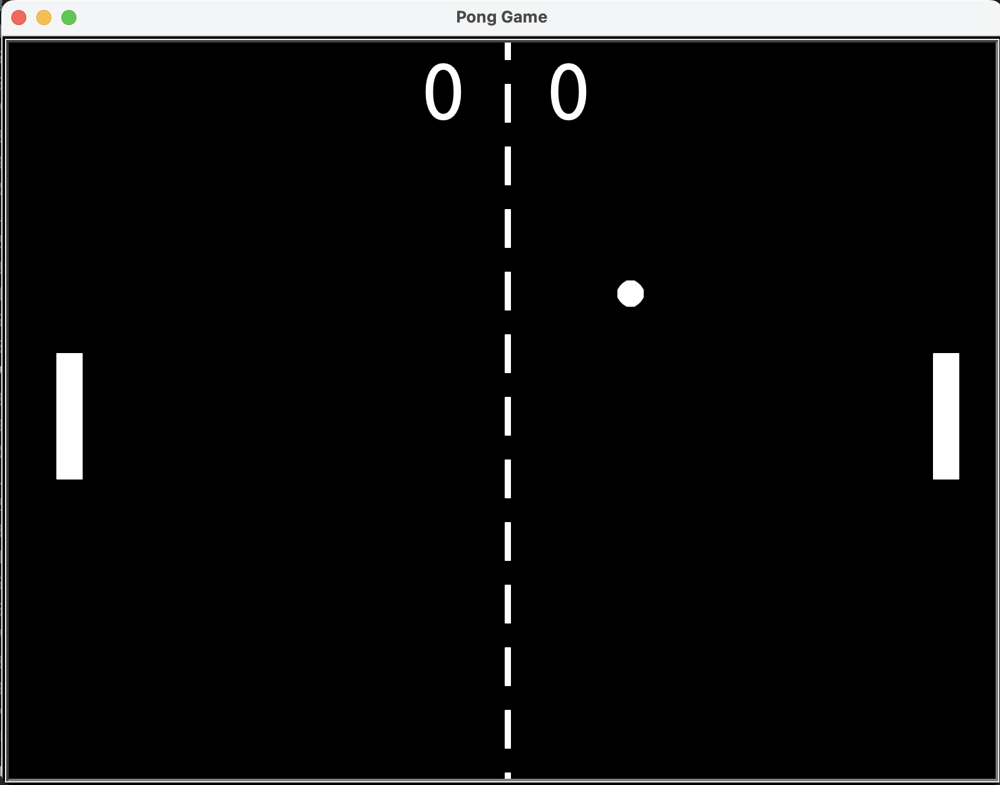

# Classic Pong Game

Bu, Python ile yazılmış klasik Pong oyunudur. Oyuncular, her biri bir paddle'ı kontrol ederek topu rakiplerinin sahasına göndermeye çalışır. Oyun, basit bir `turtle` tabanlı grafikle yapılmıştır.

## 🛠️ Gereksinimler

- Python 3.x
- `turtle` kütüphanesi

## ⚙️ Kurulum ve Çalıştırma

1. Python yüklü olduğundan emin olun.
2. Proje dosyasını bilgisayarınıza indirin.
3. Terminal veya komut istemcisinde proje klasörüne gidin.
4. `python main.py` komutunu kullanarak oyunu başlatın.

## 📸 Ekran Görüntüsü

## 📩 Mesaj

Bu, ilk Pong oyunu projelerimden biri. Oyun mekanikleri basit, ancak eğlenceli! Geri bildirimlere açığım ve oyunu geliştirmeyi planlıyorum.

İyi eğlenceler! 🏓
