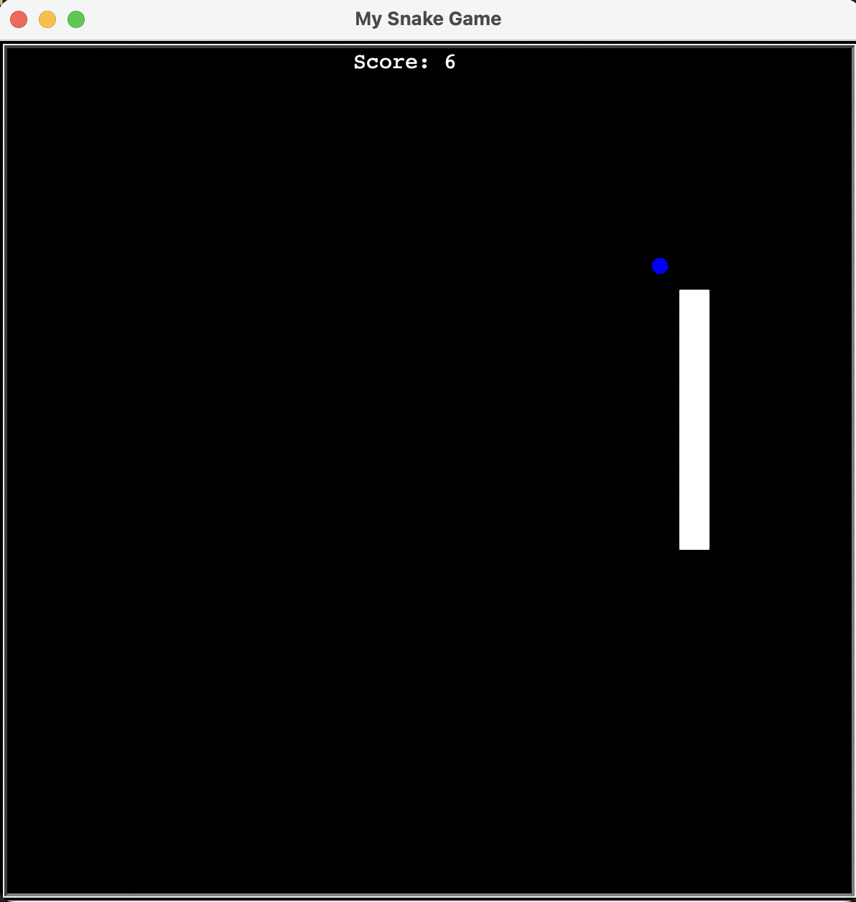

# Classic Snake Game

Bu, Python ile yazılmış klasik Snake oyunudur. Oyuncu, ekranda hareket eden yılanı yönlendirerek yemleri yemeye çalışır. Yılan her yediği yemle büyür ve uzunluğuna göre daha dikkatli hareket etmeniz gerekir. Eğer yılan duvara çarparsa ya da kendisine çarparsa oyun sona erer.

## 🛠️ Gereksinimler

- Python 3.x
- `turtle` kütüphanesi

## ⚙️ Kurulum ve Çalıştırma

1. Python yüklü olduğundan emin olun.
2. Proje dosyasını bilgisayarınıza indirin.
3. Terminal veya komut istemcisinde proje klasörüne gidin.
4. `python snake.py` komutunu kullanarak oyunu başlatın.

## 📸 Ekran Görüntüsü

## 📩 Mesaj

Bu, klasik Snake oyununu Python ve Turtle ile geliştirdiğim projelerimden biri. Yılanın hareketlerini kontrol etmek eğlenceli ve zaman geçirmek için harika bir oyun. Geri bildirimlere açığım ve projeyi geliştirmeyi düşünüyorum.

İyi eğlenceler! 🐍🍏
