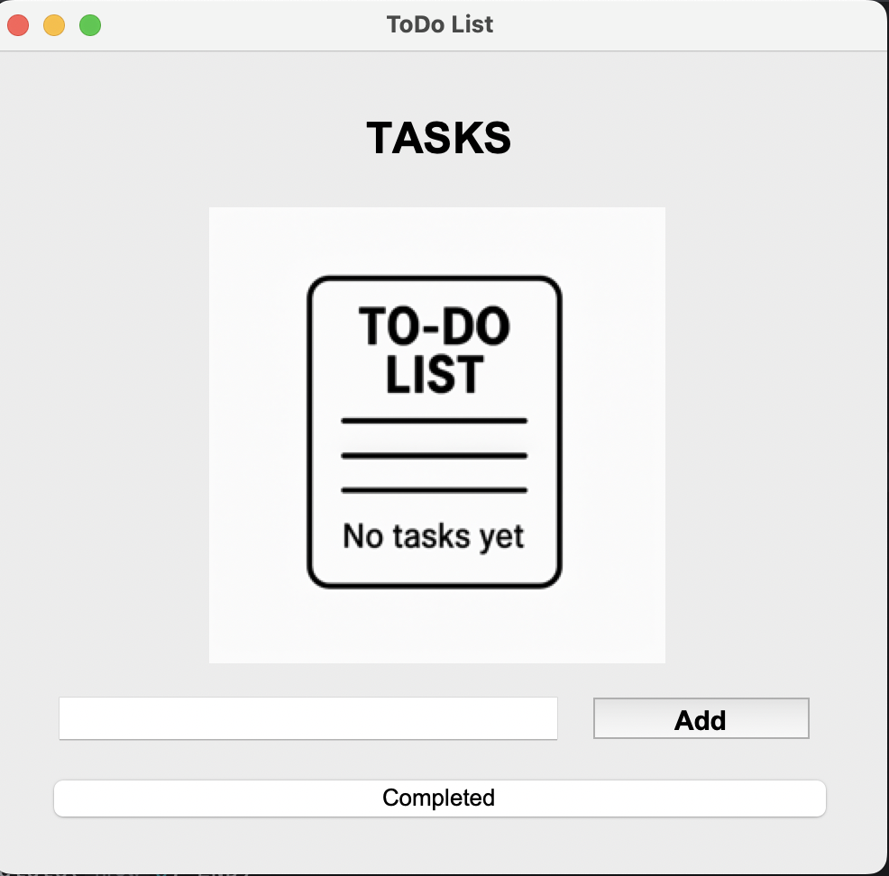
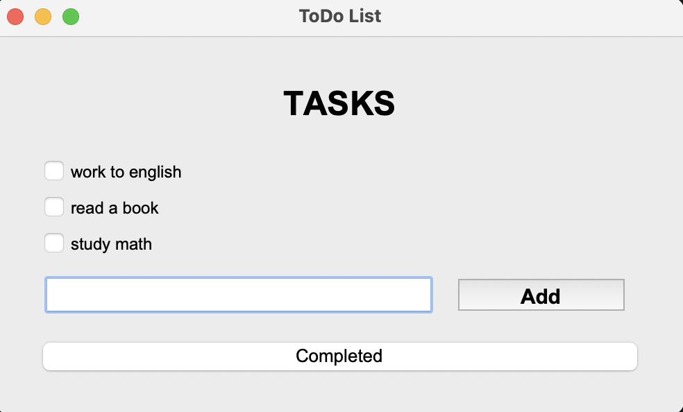

# ✅ To-Do List App (Tkinter)

Bu proje, Python'un `tkinter` kütüphanesi kullanılarak oluşturulmuş basit bir **Yapılacaklar Listesi (To-Do List)** uygulamasıdır.  
Kullanıcı, görev ekleyebilir, tamamlanan görevleri işaretleyebilir ve tamamlananları ayrı bir listede görüntüleyebilir.

## 🖼️ Uygulama Arayüzü

Aşağıda uygulamanın arayüzüne ait bir örnek görüntü yer almaktadır:

> 📷 Örnek Görsel:  

---

## ⚙️ Özellikler

- 📝 Görev ekleme
- ✅ Görevi tamamlandı olarak işaretleme
- 📄 Tamamlanan görevleri gösterme
- 💾 Görevler ve tamamlananlar dosyaya kaydedilir (`task_file.txt`, `completed_file.txt`)
- 📷 Hiç görev yoksa görsel gösterimi (`no_tasks_yet_.png`)

---

## 🚀 Başlangıç

## Gereksinimler:
- Python 3.7+
- Tkinter (genelde Python ile birlikte gelir)

## Çalıştırmak için:

python main.py

⸻

 ## 📁 Dosya Yapısı

.
├── main.py

├── task_file.txt

├── completed_file.txt

├── no_tasks_yet_.png

├── README.md

⸻

## 💡 Notlar
	•	task_file.txt → Aktif görevleri saklar.
	•	completed_file.txt → Tamamlanan görevler buraya yazılır.
	•	no_tasks_yet_.png → Görev yoksa başlangıç ekranında gösterilir.
	•	Uygulama kapanıp açılsa bile görevler kaybolmaz.

⸻

### 🧑‍💻 Geliştirici

İsmail

Python ve GUI programlamaya ilgili bir öğrenci projesi.

