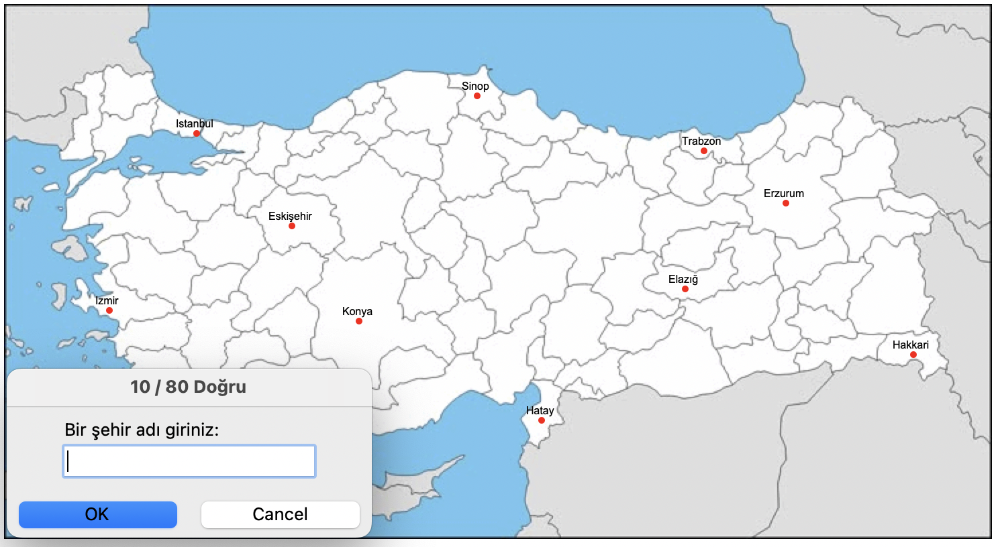

# 🇹🇷 Türkiye Şehir Tahmin Oyunu

Bu proje, Python’un `turtle` ve `pandas` kütüphaneleri kullanılarak geliştirilmiş basit ve eğlenceli bir **şehir tahmin oyunudur**. Oyuncu, Türkiye haritası üzerinde şehirleri doğru tahmin etmeye çalışır.

## 🧠 Nasıl Oynanır?

- Program başlatıldığında bir Türkiye haritası ekrana gelir.
- Oyuncu şehir isimlerini yazar.
- Doğru tahmin edilen şehirler harita üzerinde işaretlenir ve isimleri yazılır.
- Oyuncu `exit` yazarak oyunu sonlandırabilir.
- Bulunamayan şehirler `bulamadıklarım.csv` dosyasına kaydedilir.

## 🔧 Kullanılan Teknolojiler

- Python 🐍
- `turtle` (grafik arayüz)
- `pandas` (veri işleme)
- `.csv` dosyası (şehir isimleri ve koordinatlar)
- `.gif` harita görseli

## 🗂️ Gerekli Dosyalar

Projeyi düzgün çalıştırmak için aşağıdaki dosyaların aynı klasörde bulunması gerekir:

- `şehirlerin_koordinatları.csv` – şehir isimleri ve x/y koordinatlarını içerir
- `türkiye-haritası.gif` – harita arka plan görseli
- `main.py` – oyun kodları (senin yazdığın Python dosyası)

## 📁 Örnek Dosya Yapısı
türkiye-sehir-oyunu/
├── main.py
├── şehirlerin_koordinatları.csv
├── türkiye-haritası.gif
├── bulamadıklarım.csv  # (oyun sonunda otomatik oluşur)
└── README.md

## 🧭 Koordinatlar Hakkında

Projede kullanılan `şehirlerin_koordinatları.csv` dosyasındaki tüm koordinatlar **manuel olarak tarafımdan belirlenmiştir**.  
Her bir şehir, harita üzerindeki konumuna göre tek tek seçilerek uygun x ve y değerleri girilmiştir.

Bu dosya, oyunun işlevselliği açısından temel bileşenlerden biridir ve tamamen özgün olarak hazırlanmıştır.

## 👤 Geliştiren

Bu proje, Python öğrenme sürecinde **İsmail** tarafından geliştirilmiştir.  
Amacı hem eğlenmek hem de kodlama becerilerini geliştirmektir. 🎯

---

🎉 İyi oyunlar!
